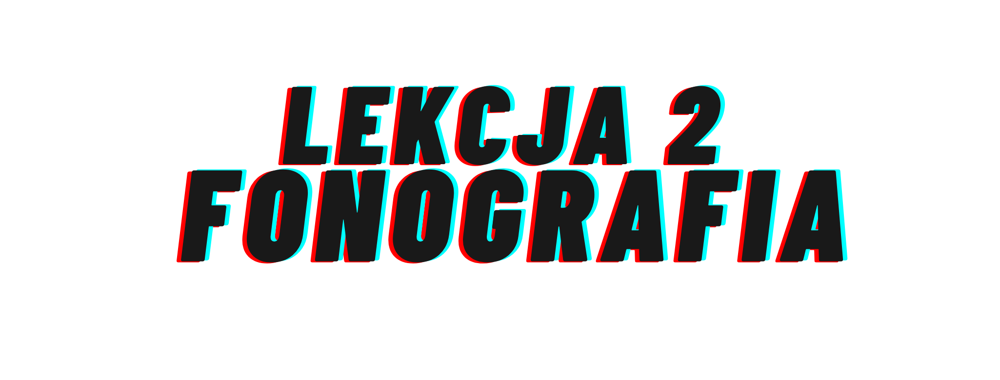

<!DOCTYPE html>
<html lang="en">

<head>
  <meta charset="UTF-8">
  <meta name="viewport" content="width=device-width, initial-scale=1.0">
  <meta http-equiv="X-UA-Compatible" content="ie=edge">
  <link rel="stylesheet" href="https://stackpath.bootstrapcdn.com/bootstrap/4.4.1/css/bootstrap.min.css" integrity="sha384-Vkoo8x4CGsO3+Hhxv8T/Q5PaXtkKtu6ug5TOeNV6gBiFeWPGFN9MuhOf23Q9Ifjh" crossorigin="anonymous">
  <link rel="stylesheet" href="https://cdnjs.cloudflare.com/ajax/libs/font-awesome/5.14.0/css/all.min.css" integrity="sha512-1PKOgIY59xJ8Co8+NE6FZ+LOAZKjy+KY8iq0G4B3CyeY6wYHN3yt9PW0XpSriVlkMXe40PTKnXrLnZ9+fkDaog==" crossorigin="anonymous" />
  <link rel="stylesheet" href="./style.css">
  <title>Muzyka - Twórz Samodzielnie &hearts;</title>
  </head>
  <body>

    <nav id="main-nav" class="navbar navbar-expand-sm bg-light navbar-light sticky-top">
      

        <a href="index.html" class="navbar-brand">Muzyka - Twórz Samodzielnie &hearts;</a>
        <button class="navbar-toggler" type="button" data-toggle="collapse" data-target="#navbarCollapse">
          
        </button>
        

          <ul class="navbar-nav ml-auto">
            <li class="nav-item">
              <a href="#intro" class="nav-link">Kurs Online</a>
            </li>
            <li class="nav-item">
              <a href="#lesson-one" class="nav-link">Zapis Muzyki</a>
            </li>
            <li class="nav-item">
              <a href="#lesson-two" class="nav-link">Fonografia</a>
            </li>
            <li class="nav-item">
              <a href="#lesson-three" class="nav-link">Instrumenty</a>
            </li>
          </ul>
        

      

    </nav>

    <section id="intro">
      

        

          
          

            
          

          

            <h4 class="h4 text-justify">Kurs online zachęcający do tworzenia muzyki w domu
              odkrywający przed uczestnikiem podstawowe zagadnienia z zakresu:</h4>
            <h4><i class=" fas fa-music"></i> podstaw muzyki</h4>
            <h4><i class="fas fa-music"></i> stylów muzycznych</h4>
            <h4><i class="fas fa-music"></i> historii muzyki nowoczesnej</h4>
            <h4><i class="fas fa-music"></i> rozróżniania instrumentów muzycznych</h4>
            <h4><i class="fas fa-music"></i> świadomego korzystania z bibliotek cyfrowych</h4>
            
ORAZ

            <h4 class="text-justify">tworzenia prostego utworu muzycznego za pomocą programu Ableton oraz publikowania swojej twórczości na portalu YouTube</h4>
          

          

            

              
              

                <h4 class="card-title">ZDOBĄDŹ CERTYFIKAT</h4>
                
Zrealizowano w ramach programu stypendialnego Ministra Kultury i Dziedzictwa Narodowego – Kultura w sieci.

                <a href="https://docs.google.com/forms/d/1cdbGjLbx_4sxRT1eveJSYYmSjr1fdjQ-pJ9eLy_j-zg/prefill
" class="btn btn-block btn-primary">Zdobądź Certyfikat</a>
              

            

          

        

      

    </section>

    <section id="lesson-one">
      

        

          

            

            
Co przekazują nuty? Dlaczego w 2020 roku najczęściej zapisujemy muzykę zupełnie inaczej?

            

              <iframe src="https://www.youtube.com/embed/GSLhFRUBVoo" frameborder="0" allow="accelerometer; autoplay; encrypted-media; gyroscope; picture-in-picture" allowfullscreen></iframe>
            

            

              

                
Przykłady muzyczne nawiązujące do lekcji:

              

              

                

                  <iframe src="https://open.spotify.com/embed/playlist/3exZ2HfeJCbFo3ICS5y0Jx" frameborder="0" allowtransparency="true" allow="encrypted-media"></iframe>
                

              

            

             
          

        

      

    </section>
    <section id="lesson-two">
      

        

          

            

            
Jak na rozwój muzyki wpłynął prąd? Czym jest fonografia? Słuchawki czy głośniki?

            

              <iframe src="https://www.youtube.com/embed/HHxcZ8N-S20" frameborder="0" allow="accelerometer; autoplay; encrypted-media; gyroscope; picture-in-picture" allowfullscreen></iframe>
            

            

              

                
Kilka słów o tym, jak świat wyglądał bez prądu i jak kolejne wynalazki zasilane prądem podnosiły jakość życia w Ameryce

              

              

                

                  <iframe src="https://www.youtube.com/embed/n3M9HKK-onM"frameborder="0" allow="accelerometer; autoplay; encrypted-media; gyroscope; picture-in-picture" allowfullscreen></iframe>
                

              

            

             
          

        

      

    </section>
    <section id="lesson-three">
      

        

          

            

            
Jak rozróżnić instrumenty muzyczne? Jak rozwineły się instrumenty muzyczne wraz z rozwojem prądu?

            

              <iframe src="https://www.youtube.com/embed/Lyjku3KwyNg" frameborder="0" allow="accelerometer; autoplay; encrypted-media; gyroscope; picture-in-picture" allowfullscreen></iframe>
            

            

              

                
Przykłady muzyczne nawiązujące do lekcji:

              

              

                

          <iframe src="https://open.spotify.com/embed/playlist/2NRiRlCqhh7sbJTuUM588W" frameborder="0" allowtransparency="true" allow="encrypted-media"></iframe>
                

              

            

             
          

        

      

    </section>
    </body>
    </html>
