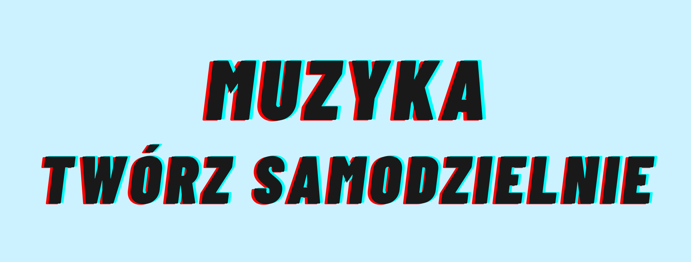
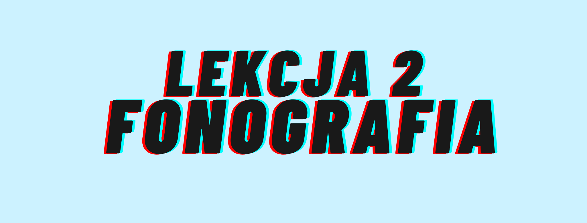
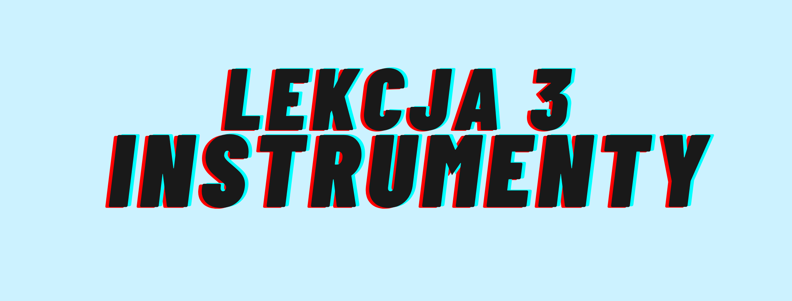

<!DOCTYPE html>
<html lang="en">

<head>
  <meta charset="UTF-8">
  <meta name="viewport" content="width=device-width, initial-scale=1.0">
  <meta http-equiv="X-UA-Compatible" content="ie=edge">
  <link rel="stylesheet" href="https://stackpath.bootstrapcdn.com/bootstrap/4.4.1/css/bootstrap.min.css" integrity="sha384-Vkoo8x4CGsO3+Hhxv8T/Q5PaXtkKtu6ug5TOeNV6gBiFeWPGFN9MuhOf23Q9Ifjh" crossorigin="anonymous">
  <title>Muzyka - Twórz Samodzielnie &hearts;</title>
</head>

<body class="container text-center">
  
   
   
  <h5>Kurs online zachęcający do tworzenia muzyki w domu, odkrywający przed uczestnikiem podstawowe zagadnienia z zakresu podstaw muzyki, stylów muzycznych, historii muzyki nowoczesnej, rozróżniania instrumentów muzycznych, świadomego korzystania z
    bibliotek cyfrowych, tworzenia prostego utworu muzycznego za pomocą programu Ableton Lite oraz publikowania swojej twórczości na portalu YouTube.
  </h5>
   
  

     
    

    
Co przekazują nuty? Dlaczego w 2020 roku najczęściej zapisujemy muzykę zupełnie inaczej?

     
    <iframe width="560" height="315" src="https://www.youtube.com/embed/GSLhFRUBVoo" frameborder="0" allow="accelerometer; autoplay; encrypted-media; gyroscope; picture-in-picture" allowfullscreen></iframe>
     
     
    
Przykłady muzyczne nawiązujące do lekcji:

     
    <iframe src="https://open.spotify.com/embed/playlist/3exZ2HfeJCbFo3ICS5y0Jx" width="580" height="380" frameborder="0" allowtransparency="true" allow="encrypted-media"></iframe>
     
  

  

     
    
    
Jak na rozwój muzyki wpłynął prąd? Czym jest fonografia? Słuchawki czy głośniki?

     
    <iframe width="560" height="315" src="https://www.youtube.com/embed/HHxcZ8N-S20" frameborder="0" allow="accelerometer; autoplay; encrypted-media; gyroscope; picture-in-picture" allowfullscreen></iframe>
     
     
    
 Kilka słów o tym, jak świat wyglądał bez prądu i jak kolejne wynalazki zasilane prądem podnosiły jakość życia w Ameryce

 
<iframe width="560" height="315" src="https://www.youtube.com/embed/n3M9HKK-onM" frameborder="0" allow="accelerometer; autoplay; encrypted-media; gyroscope; picture-in-picture" allowfullscreen></iframe>
 
     
  

  

     
    
    
Jak rozróżnić instrumenty muzyczne? Jak rozwineły się instrumenty muzyczne wraz z rozwojem prądu?

     
    <iframe width="560" height="315" src="https://www.youtube.com/embed/Lyjku3KwyNg" frameborder="0" allow="accelerometer; autoplay; encrypted-media; gyroscope; picture-in-picture" allowfullscreen></iframe>
     
     
    
Przykłady muzyczne nawiązujące do lekcji:

     
    <iframe src="https://open.spotify.com/embed/playlist/2NRiRlCqhh7sbJTuUM588W" width="580" height="380" frameborder="0" allowtransparency="true" allow="encrypted-media"></iframe>
     
     
  

  

     
     
    <h2>Lena Romul - <a href="https://www.karrot.pl/lenaromul">o Autorce</a></h2>
     
    
     
     
    <h5><a href="https://www.facebook.com/Lena.Romul">Facebook</a></h5>
    <h5><a href="https://www.instagram.com/lenaromul/">Instagram</a></h5>
     
  

   
  
 Chcesz zdobyć certyfikat ukończenia kursu "Muzyka - Twórz samodzielnie" ?

  
Napisz do mnie na lenaromul@gmail.com, otrzymasz PDF z zagadnieniami z zajęć oraz test zdobytych umiejętności. 

   
  Jeśli uda Ci się zaliczyć test i poprawnie załadować swój utwór na YouTube otrzymasz imienny cetryfikat ukończenia kursu "Muzyka - Twórz Samodzielnie".
   
  

    
<I>Zrealizowano w ramach programu stypendialnego Ministra Kultury i Dziedzictwa Narodowego – Kultura w sieci</I>

    
     
     
  

</body>

</html>
